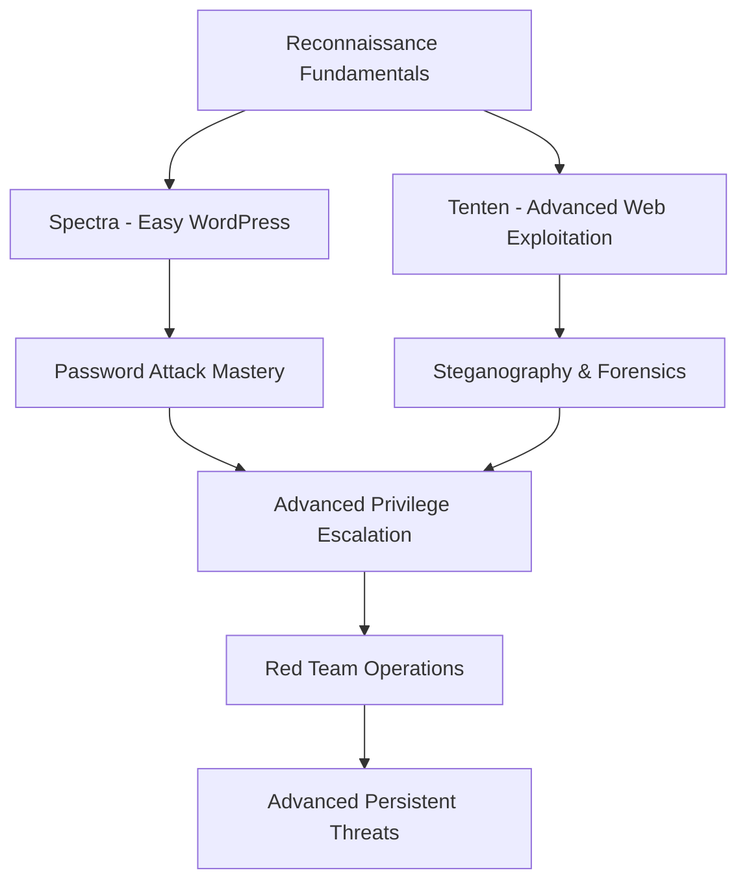

# ⚡ Hack The Box - Penetration Testing Writeups Collection ⚡

## Overview

Welcome to my collection of **Hack The Box** penetration testing writeups! This repository contains detailed exploitation walkthroughs and methodologies for various retired HTB machines, showcasing offensive cybersecurity techniques and ethical hacking skills.

**Hack The Box** is the world's leading cybersecurity training platform, providing realistic vulnerable machines that simulate real-world enterprise environments. These writeups demonstrate practical penetration testing skills essential for red team operations, vulnerability assessments, and security research.

---

## Learning Objectives

Through these machines, you'll develop expertise in:

* **Web Application Security** - OWASP Top 10 exploitation techniques
* **System Exploitation** - Buffer overflows, privilege escalation, RCE
* **Network Penetration** - Service enumeration, lateral movement
* **Vulnerability Research** - CVE analysis and exploit development
* **Post-Exploitation** - Persistence, pivoting, and data exfiltration
* **Methodology** - Structured approach to penetration testing

---

## Machines Collection

### Retired Machines

| Machine | Difficulty | OS | Skills | Status | Writeup |
|---------|------------|-------|---------|---------|---------|
| **[Tenten](https://www.hackthebox.com/machines/tenten)** |  |  | WordPress, CVE-2015-6668, Steganography, SUID | ✅ Complete | [📖 View](./Tenten/README.md) |
| **[Spectra](https://www.hackthebox.com/machines/spectra)**  |  |  | WordPress, Password Cracking, Privilege Escalation | ✅ Complete | [📖 View](./Spectra/README.md) |
| **[Responder](https://www.hackthebox.com/machines/responder)** |  |  | LFI, RFI, NTLM Capture, Responder, Password Cracking, WinRM | ✅ Complete | [📖 View](./Responder/README.md) |

### Statistics

- **Total Machines:** 3
- **Completed:** 3 
- **Success Rate:** 100%
- **Difficulty Distribution:** 2 Easy, 1 Medium
- **OS Coverage:** Linux, Windows
- **Skills Developed:** 12+ core competencies

---

## Tools & Techniques Arsenal

### Reconnaissance & Enumeration
| Category | Tools Used |
|----------|------------|
| **Network Scanning** | nmap, masscan, rustscan |
| **Web Enumeration** | gobuster, dirb, wpscan, whatweb |
| **Service Analysis** | netcat, telnet, curl |
| **DNS/Subdomain** | dig, dnsrecon, sublist3r |

### Exploitation & Post-Exploitation
| Category | Tools Used |
|----------|------------|
| **Web Exploitation** | Burp Suite, sqlmap, nikto |
| **System Exploitation** | Metasploit, searchsploit, custom scripts |
| **Privilege Escalation** | LinPEAS, winPEAS, GTFOBins |
| **Password Attacks** | john, hashcat, hydra, medusa |
| **Steganography** | steghide, binwalk, strings |

### Frameworks & Methodologies
- **OWASP Testing Guide** - Web application security testing
- **PTES** - Penetration Testing Execution Standard
- **NIST SP 800-115** - Technical guide to information security testing
- **OSSTMM** - Open Source Security Testing Methodology

---

## 🎓 Machine Descriptions

### Tenten - WordPress Plugin Vulnerability Chain
**Difficulty:** Medium | **OS:** Linux (Ubuntu)

**Attack Vector Summary:**
WordPress Job Manager plugin vulnerability (CVE-2015-6668) leading to file disclosure, steganographic data extraction, SSH key cracking, and SUID binary privilege escalation.

**Key Techniques Demonstrated:**
- WordPress security assessment and plugin enumeration
- CVE exploitation and proof-of-concept development
- Steganography analysis with hidden SSH key extraction
- John the Ripper password cracking techniques
- Linux privilege escalation through misconfigured SUID binaries

**Skills Developed:** Web App Security, CVE Research, Steganography, Credential Cracking, Linux PrivEsc

---

### Spectra - WordPress Configuration & Credential Management
**Difficulty:** Easy | **OS:** Linux (Chrome OS based)

**Attack Vector Summary:**
WordPress configuration file exposure leading to database credentials, password hash cracking, and system-level privilege escalation through sudo misconfigurations.

**Key Techniques Demonstrated:**
- WordPress installation security assessment
- Database credential extraction from configuration files
- Password hash analysis and offline cracking techniques
- Linux user enumeration and privilege mapping
- Sudo privilege abuse for root access escalation

**Skills Developed:** Config File Analysis, Hash Cracking, User Enumeration, Sudo Exploitation

---

## Skill Development Progression

---

## Professional Relevance

These machines prepare you for:

### Entry-Level Positions
- **Junior Penetration Tester** - Structured vulnerability assessment
- **Security Analyst** - Threat identification and analysis  
- **Vulnerability Researcher** - CVE analysis and exploitation
- **Bug Bounty Hunter** - Independent security research

### Advanced Roles
- **Senior Penetration Tester** - Complex infrastructure assessments
- **Red Team Operator** - Advanced persistent threat simulation
- **Security Consultant** - Client-facing security advisory
- **Exploit Developer** - Custom payload and tool development

---

## Methodology Framework

### Phase 1: Reconnaissance
1. **Network Discovery** - Port scanning and service enumeration
2. **Service Analysis** - Version detection and vulnerability mapping
3. **Web Application Assessment** - Technology stack identification
4. **Information Gathering** - OSINT and metadata analysis

### Phase 2: Vulnerability Assessment  
1. **Automated Scanning** - Vulnerability scanner deployment
2. **Manual Testing** - Custom test case development
3. **CVE Research** - Public exploit verification
4. **Attack Surface Mapping** - Entry point prioritization

### Phase 3: Exploitation
1. **Initial Access** - Remote code execution achievement
2. **Foothold Establishment** - Stable shell acquisition  
3. **Local Enumeration** - System reconnaissance and mapping
4. **Privilege Escalation** - Administrative access acquisition

### Phase 4: Post-Exploitation
1. **Evidence Collection** - Flag capture and documentation
2. **Persistence Mechanisms** - Access maintenance techniques
3. **Lateral Movement** - Network expansion opportunities
4. **Impact Assessment** - Business risk quantification

---

## Learning Resources

### HTB Official Resources
- [Hack The Box Academy](https://academy.hackthebox.com/)
- [HTB Starting Point](https://app.hackthebox.com/starting-point)
- [HTB Retired Machines](https://app.hackthebox.com/machines/retired)

### Penetration Testing Guides
- [OWASP Testing Guide](https://owasp.org/www-project-web-security-testing-guide/)
- [PTES Technical Guidelines](http://www.pentest-standard.org/index.php/Main_Page)
- [PayloadsAllTheThings](https://github.com/swisskyrepo/PayloadsAllTheThings)
- [GTFOBins](https://gtfobins.github.io/)

### Skill Development Platforms
- [TryHackMe](https://tryhackme.com/) - Beginner-friendly challenges
- [VulnHub](https://www.vulnhub.com/) - Vulnerable VMs for practice
- [OverTheWire](https://overthewire.org/wargames/) - Command line challenges
- [PentesterLab](https://pentesterlab.com/) - Web application security

---

## Usage Guidelines

### For Practitioners
1. **Follow responsible disclosure** - Only test authorized systems
2. **Understand the methodology** - Don't just copy commands
3. **Practice in legal environments** - Use personal labs or authorized platforms  
4. **Document your process** - Build your own knowledge base
5. **Stay updated** - Security landscape evolves rapidly

### For Students & Educators
- Writeups include **step-by-step methodology** for learning
- **Tool explanations** provided for educational context
- **Alternative approaches** discussed for comprehensive understanding
- **Real-world applications** connected to industry practices

---

## Achievements & Certifications

### HTB Profile Highlights
- **Machines Owned:** 2/2 (100% Success Rate)
- **User Flags:** 2/2 Captured
- **Root Flags:** 2/2 Captured
- **Skill Categories:** Web, Cryptography, Steganography, Linux PrivEsc

### Certification Relevance
These skills directly support preparation for:
- **OSCP** - Offensive Security Certified Professional
- **OSWE** - Offensive Security Web Expert  
- **CEH** - Certified Ethical Hacker
- **GPEN** - GIAC Penetration Tester

---

## Connect & Collaborate

### Professional Networks
- **LinkedIn:** Connect for career discussions and industry insights
- **Twitter:** Follow for real-time security research and updates
- **GitHub:** Collaborate on security tools and methodologies

### Community Contributions
- **Security Conferences:** Presenting research and methodologies
- **Open Source Projects:** Contributing to penetration testing tools
- **Bug Bounty Programs:** Responsible vulnerability disclosure
- **Educational Content:** Sharing knowledge through blogs and tutorials

---

## ⚠️ Legal Disclaimer

> **Authorized Testing Only**
> 
> These writeups are created for educational purposes using retired HTB machines. All techniques demonstrated should only be applied to systems you own or have explicit permission to test.
> 
> **Unauthorized access to computer systems is illegal and unethical.**
> 
> Always follow responsible disclosure practices and comply with local laws and organizational policies when conducting security testing.

---

## Contributing

Interested in improving these writeups? You can:

- **Report technical errors** or methodology improvements
- **Suggest alternative exploitation paths** for educational value  
- **Add supplementary resources** or tool recommendations
- **Share optimization techniques** for better efficiency

---

*Last Updated: December 2024*  
*Next Target: [Medium/Hard] Machine - Advanced Active Directory Exploitation*

---

**"The best defense is a deep understanding of offense."**

## Contact

- GitHub: [3stefani](https://github.com/3stefani)
- HTB Profile: [3stefani](https://app.hackthebox.com/profile/overview)
