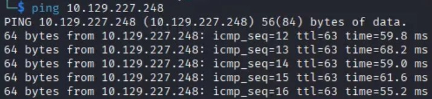
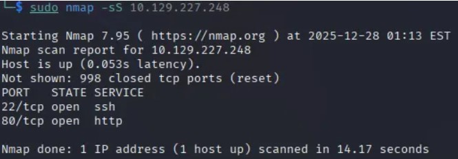
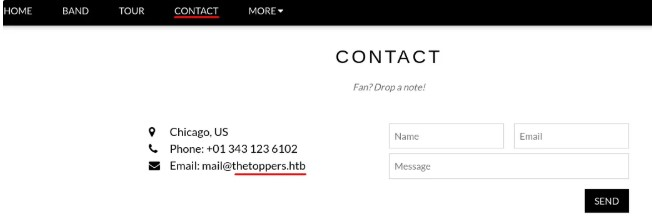

# ⭐ Three – Hack The Box Write-up ⭐

---

## Machine Info

| Property | Value |
|--------|-------|
| **Difficulty** | Easy |
| **OS** | Linux |
| **IP** | 10.129.x.x |
| **Category** | Starting Point (Tier 0) |
| **Tags** | AWS S3, Subdomain Enumeration, RCE, Misconfiguration |

---

## Overview

In this lab, we exploit a misconfigured Amazon S3-compatible service exposed through a discovered subdomain.  
By enumerating the S3 bucket, we identify that it allows unauthenticated file uploads.  
Uploading a malicious PHP file results in **remote code execution (RCE)** on the web server, allowing us to enumerate the filesystem and retrieve the flag.

This machine belongs to **Hack The Box – Starting Point (Tier 1)** and introduces fundamental concepts such as:

- Subdomain enumeration  
- Amazon S3 bucket interaction  
- Cloud storage misconfigurations  
- Remote Code Execution (RCE)  
- Linux filesystem enumeration  

---

## Key Steps
Network & Service Enumeration

MITRE ATT&CK: **T1046 – Network Service Discovery**
OWASP Top 10: **A05:2021 – Security Misconfiguration**

Subdomain Enumeration

MITRE ATT&CK: **T1583.002 – Acquire Infrastructure: Domains**
OWASP Top 10: **A05:2021 – Security Misconfiguration**

Discovering an Exposed S3-Compatible Service

MITRE ATT&CK: **T1087 – Account Discovery**
OWASP Top 10: **A02:2021 – Cryptographic Failures**

Unauthorized Access to S3 Bucket

MITRE ATT&CK: **T1530 – Data from Cloud Storage Object**
OWASP Top 10: **A05:2021 – Security Misconfiguration**

Remote Code Execution via File Upload

MITRE ATT&CK: **T1105 – Ingress Tool Transfer**
OWASP Top 10: **A03:2021 – Injection**

Post-Exploitation Enumeration & Flag Retrieval

MITRE ATT&CK: **T1083 – File and Directory Discovery**
OWASP Top 10: **A01:2021 – Broken Access Control**

---

## Attack Flow Summary

1. Network & service enumeration  
2. Subdomain discovery (`s3.thetoppers.htb`)  
3. Identification of exposed S3-compatible service  
4. Unauthorized access to S3 bucket  
5. Malicious PHP file upload  
6. Remote command execution  
7. Flag retrieval  

---
## Connectivity Check

Before enumeration, we verified connectivity to the target machine:

<pre>ping 10.129.x.x</pre>

The host responded successfully, confirming network reachability.
Furthermore, we observe that ttl = 63

- This value (close to 64) indicates that we are dealing with a **Linux** machine.

> By default, TTL values ​​around 64 indicate that the machine is Linux, while values ​​of 128 would indicate that the machine is Windows.

>

## Enumeration

### Port Scanning

<pre>sudo nmap -sS 10.129.x.x</pre>

As we can see, there are two open TCP ports. Port 80 indicates that we can connect using a browser to see if there is a website running on this port.

## Adding the hostname
From the previous scan, we know that we can connect to the server with our browser. When we visit http://10.129.X.X, a web page appears:

Then, navigating to the “Contact” page, we see an email address with the domain “thetoppers.htb”:

Since no DNS server is provided, we manually resolved the domain:
<pre>sudo nano /etc/hosts</pre>

Added:

<pre>10.129.x.x thetoppers.htb</pre>

